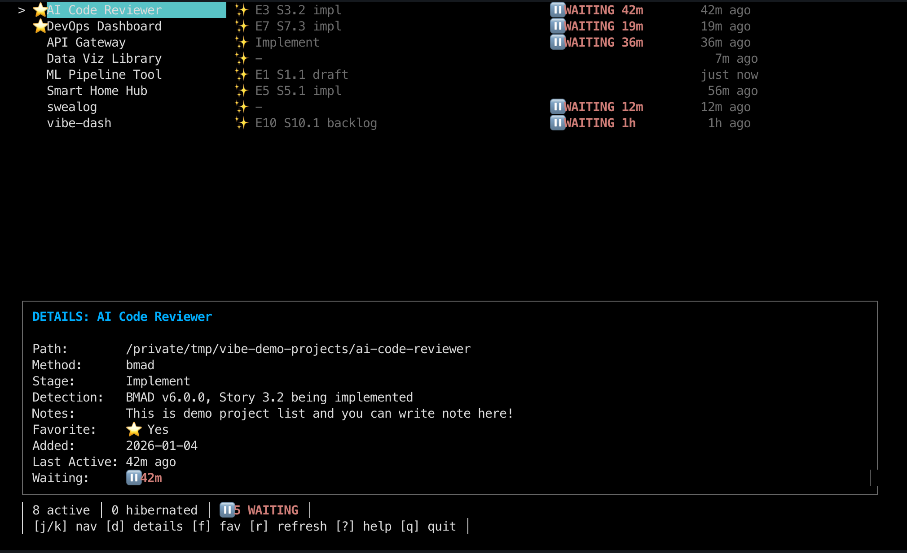
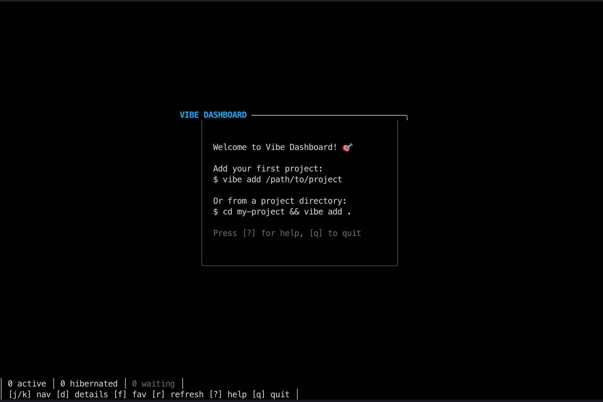
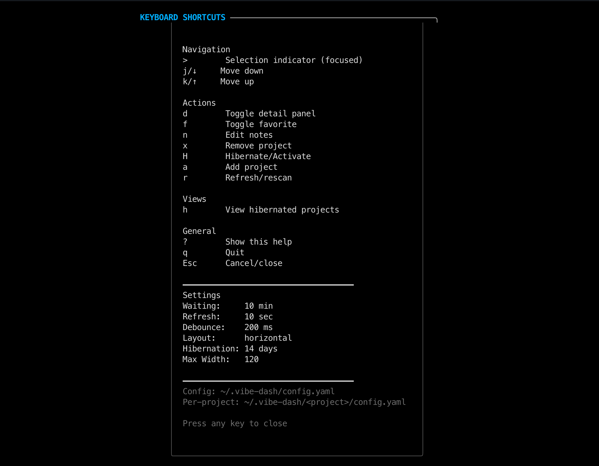

# vibe-dash

[](https://github.com/JeiKeiLim/vibe-dash/actions/workflows/ci.yml)
[](https://golang.org/)
[](LICENSE)

A terminal dashboard for tracking AI-assisted coding projects. Monitor multiple projects, detect workflow stages, and see when AI agents are waiting for your input—all from a single unified interface.



## About This Project

This project is a **real-world demonstration of the [BMAD Method](https://github.com/bmadcode/BMAD-METHOD)** — a structured methodology for AI-assisted software development (aka "vibe coding").

Every feature, from the initial architecture to the TUI polish, was developed through BMAD's phased workflow: requirements gathering, architecture design, epic/story planning, and iterative implementation. The entire development history — PRDs, architecture docs, epics, stories, and retrospectives — lives in [`docs/sprint-artifacts/`](docs/sprint-artifacts/).

**Why build this?** I wanted hands-on experience with BMAD to understand how structured AI collaboration scales across a non-trivial project. Having minimal Go experience and no TUI background, this was also a test of whether AI-assisted development could bridge the gap. vibe-dash became both the learning vehicle and a practical tool I use to monitor my other AI-assisted projects.

### Development Highlights

- **Incremental development** — Built story by story across 100+ iterations
- **Maintained structure** — Same patterns, conventions, and test coverage throughout
- **Full transparency** — Every PRD, architecture decision, and retrospective is public
- **Dogfooding** — vibe-dash monitors its own development

If you're curious about BMAD or want to see what continuous AI-assisted development looks like in practice, explore the sprint artifacts — they tell the full story of how this codebase evolved from concept to working software.

## Features

- **Multi-Project Dashboard** — Track all your AI coding projects from one terminal
- **Real-time Monitoring** — File watcher detects changes and updates the dashboard automatically
- **Agent Waiting Detection** — Know instantly when your AI coding agent needs input
- **Methodology Support** — Built-in support for BMAD and Speckit workflows
- **Project Hibernation** — Auto-hibernate inactive projects; auto-activate on file changes
- **Favorites & Notes** — Star important projects and add personal notes
- **Flexible Layouts** — Vertical (side-by-side) or horizontal (stacked) detail panel

## Quick Start

### Installation

**Download from Releases (Recommended)**

```bash
# macOS ARM64 (Apple Silicon)
curl -Lo vdash.tar.gz https://github.com/JeiKeiLim/vibe-dash/releases/latest/download/vdash_darwin_arm64.tar.gz
tar -xzf vdash.tar.gz && rm vdash.tar.gz
mkdir -p ~/.local/bin && mv vdash ~/.local/bin/

# macOS Intel
curl -Lo vdash.tar.gz https://github.com/JeiKeiLim/vibe-dash/releases/latest/download/vdash_darwin_amd64.tar.gz
tar -xzf vdash.tar.gz && rm vdash.tar.gz
mkdir -p ~/.local/bin && mv vdash ~/.local/bin/

# Linux x86_64
curl -Lo vdash.tar.gz https://github.com/JeiKeiLim/vibe-dash/releases/latest/download/vdash_linux_amd64.tar.gz
tar -xzf vdash.tar.gz && rm vdash.tar.gz
mkdir -p ~/.local/bin && mv vdash ~/.local/bin/

# Linux ARM64
curl -Lo vdash.tar.gz https://github.com/JeiKeiLim/vibe-dash/releases/latest/download/vdash_linux_arm64.tar.gz
tar -xzf vdash.tar.gz && rm vdash.tar.gz
mkdir -p ~/.local/bin && mv vdash ~/.local/bin/
```

Make sure `~/.local/bin` is in your PATH (add to `~/.bashrc` or `~/.zshrc`):
```bash
export PATH="$HOME/.local/bin:$PATH"
```

**Build from Source**

```bash
# Clone the repository
git clone https://github.com/JeiKeiLim/vibe-dash.git
cd vibe-dash

# Build and install
make build
make install  # Installs to ~/go/bin/vdash
```

### Requirements

- Go 1.24 or later (for building from source)
- CGO enabled (required for SQLite)

### Add Your First Project

```bash
# Add current directory
cd your-project && vdash add .

# Or specify a path
vdash add /path/to/project --name "My Project"
```

### Launch the Dashboard

```bash
vdash
```



## Dashboard Interface


### Project List Columns

| Column | Description |
|--------|-------------|
| Name | Project name (favorites marked with star) |
| Stage | Current workflow stage (e.g., `E3/S2` = Epic 3, Story 2) |
| Status | Activity indicator with relative time |

### Status Indicators

| Indicator | Meaning |
|-----------|---------|
| `WAITING` | AI agent is waiting for user input |
| `2m ago` | Time since last file change |
| `Active` | Recent activity detected |
| `Hibernated` | Project is dormant (press `h` to view) |

## Keyboard Shortcuts

Press `?` in the dashboard to see all shortcuts.

### Navigation
| Key | Action |
|-----|--------|
| `j` / `↓` | Move down |
| `k` / `↑` | Move up |

### Actions
| Key | Action |
|-----|--------|
| `d` | Toggle detail panel |
| `f` | Toggle favorite |
| `n` | Edit notes |
| `x` | Remove project |
| `H` | Hibernate/Activate project |
| `a` | Add project (opens prompt) |
| `r` | Refresh all projects |

### Views
| Key | Action |
|-----|--------|
| `h` | View hibernated projects |
| `?` | Show help overlay |
| `q` | Quit |
| `Esc` | Cancel/close dialogs |



## CLI Commands

```bash
vdash                      # Launch interactive dashboard
vdash add [path]           # Add project to tracking
vdash list                 # List all tracked projects
vdash status <name>        # Show project status
vdash remove <name>        # Remove from tracking
vdash hibernate <name>     # Mark project as dormant
vdash activate <name>      # Reactivate hibernated project
vdash favorite <name>      # Toggle favorite status
vdash note <name> [note]   # View or set project notes
vdash rename <name> [new]  # Set or clear display name
vdash refresh              # Refresh detection for all projects
vdash config               # Manage configuration
vdash reset                # Reset project database
vdash --version            # Show version information
```

Use `vdash [command] --help` for detailed command options.

### Global Flags

```bash
-c, --config string           Config file path (default: ~/.vibe-dash/config.yaml)
    --debug                   Enable debug logging
-q, --quiet                   Suppress non-error output
-v, --verbose                 Enable verbose output
    --waiting-threshold int   Override agent waiting threshold (minutes)
```

## Configuration

Configuration is stored in `~/.vibe-dash/config.yaml`:

```yaml
storage_version: 2

settings:
  hibernation_days: 14          # Auto-hibernate after N days of inactivity
  refresh_interval_seconds: 5   # Dashboard refresh interval
  refresh_debounce_ms: 200      # File watcher debounce
  agent_waiting_threshold_minutes: 10  # WAITING indicator threshold
  detail_layout: vertical       # "vertical" (side-by-side) or "horizontal" (stacked)
  # use_emoji: true             # Force emoji (omit for auto-detect)
  # max_content_width: 120      # 0 = unlimited

projects:
  my-project:
    path: /path/to/my-project
    display_name: My Project
    favorite: true
```

### Per-Project Configuration

Override settings for specific projects in `~/.vibe-dash/<project>/config.yaml`:

```yaml
hibernation_days: 30              # This project hibernates after 30 days
agent_waiting_threshold_minutes: 5  # More sensitive waiting detection
```

## Supported Methodologies

vibe-dash automatically detects AI coding methodologies and tracks workflow stages.

### BMAD (v6)

The [BMAD Method](https://github.com/bmadcode/BMAD-METHOD) workflow is detected via:
- `.bmad/` or `_bmad/` directory
- Sprint status from `docs/sprint-artifacts/sprint-status.yaml`
- Stage format: `E<epic>/S<story>` (e.g., `E3/S2`)

### Speckit

[Speckit](https://github.com/speckit/speckit) methodology is detected via:
- `specs/`, `.speckit/`, or `.specify/` directory
- Stage based on artifact files present

### Adding Custom Detectors

Implement the `ports.MethodDetector` interface:

```go
type MethodDetector interface {
    Name() string
    CanDetect(ctx context.Context, path string) bool
    Detect(ctx context.Context, path string) (*domain.DetectionResult, error)
}
```

Register in `cmd/vdash/main.go`:

```go
registry.Register(mydetector.NewMyDetector())
```

## Architecture

vibe-dash follows hexagonal architecture (ports & adapters), established in Epic 1 and maintained consistently through 11 epics of development:

```
internal/
├── core/                  # Domain layer - ZERO external dependencies
│   ├── domain/            # Entities (Project, DetectionResult)
│   ├── ports/             # Interfaces (Repository, Detector, FileWatcher)
│   └── services/          # Use cases (Detection, Hibernation, State)
└── adapters/              # Infrastructure layer
    ├── cli/               # Cobra commands
    ├── tui/               # Bubble Tea terminal UI
    ├── persistence/       # SQLite repository + YAML config
    ├── filesystem/        # OS abstraction, file watching
    └── detectors/         # BMAD, Speckit implementations
```

This separation ensures that domain logic remains independent of infrastructure choices. New detectors, storage backends, or UI implementations can be added without modifying core business logic.

### Key Dependencies

- [Bubble Tea](https://github.com/charmbracelet/bubbletea) — Terminal UI framework
- [Cobra](https://github.com/spf13/cobra) — CLI framework
- [Viper](https://github.com/spf13/viper) — Configuration management
- [go-sqlite3](https://github.com/mattn/go-sqlite3) — SQLite driver (CGO)
- [fsnotify](https://github.com/fsnotify/fsnotify) — Cross-platform file watching

## Development

```bash
# Format code
make fmt

# Run linter
make lint

# Run unit tests
make test

# Run all tests (unit + integration)
make test-all

# Build binary
make build

# Clean build artifacts
make clean
```

### Project Structure

```
.
├── cmd/vdash/             # Application entry point
├── internal/              # Private application code
├── test/fixtures/         # Test fixture projects
├── docs/                  # Documentation and sprint artifacts
├── bin/                   # Build output
├── Makefile               # Build automation
└── go.mod                 # Go module definition
```

## Contributing

Contributions are welcome! Please:

1. Fork the repository
2. Create a feature branch (`git checkout -b feature/amazing`)
3. Make your changes with tests
4. Ensure `make lint` and `make test` pass
5. Submit a Pull Request

## License

[MIT License](LICENSE) - Copyright (c) 2025 Jongkuk Lim
