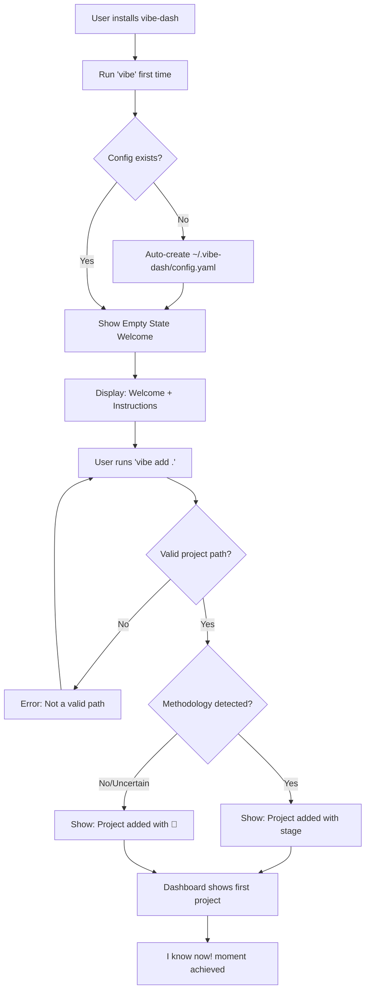

# UX Design Specification vibe-dash

**Author:** Jongkuk Lim
**Date:** 2025-12-11

---

## Executive Summary

### Project Vision

Vibe Dashboard is a CLI-first TUI dashboard serving as the central nervous system for developers managing multiple AI-assisted "vibe coding" projects. The core insight: the problem isn't code context (AI agents handle that) - it's **workflow methodology context**. WHERE am I in my structured process? What stage was I at? What comes next?

**Technology Stack:** Go + Bubble Tea (TUI/Elm architecture), Cobra (CLI), SQLite (centralized at `~/.vibe-dash/`), fsnotify (file watching)

**Design Philosophy:** "Artifacts Are Always Truth" - The dashboard never asks users to maintain state. It reads directly from project artifacts (.bmad/, specs/ folders) and surfaces workflow state automatically.

### Target Users

| User | Profile | Primary Need |
|------|---------|--------------|
| **Jeff** (Primary) | Senior freelancer managing 3-10 AI-assisted projects | Instant context restoration - eliminate "what was I doing?" moments |
| **Sam** (Secondary) | Developer learning vibe coding methodologies | Implicit workflow coaching through dashboard visibility |
| **Methodology Creators** (Growth) | BMAD-Method/Speckit creators | Plugin integration for their methodology |

**Success Vision:** "I can manage more than 10 vibe coding projects thanks to vibe dashboard. I don't waste time watching over coding agents doing their job or waiting for me."

### Key Design Challenges

1. **Information Density in Limited Terminal Space**
   - TUI constraints: 80-160 columns, 24-50 rows typical
   - Must show: project name, stage, visual indicators, timestamps, detection reasoning
   - Solution: Fixed column positions, progressive disclosure via toggleable detail panel

2. **The "Always Visible" Dashboard Paradigm**
   - Users keep this open in terminal split ALL DAY - ambient awareness, not occasional tool
   - Must be visually calm when nothing needs attention
   - Must signal urgently when ⏸️ WAITING appears
   - Updates must be smooth, not jarring

3. **Dual Mental Modes with Single UI**
   - Morning scan: Focus on stage state (where am I in methodology?)
   - Mid-work scan: Focus on waiting state (who's blocked on me?)
   - Solution: Both stage AND waiting equally prominent in every row - user's eye decides priority

4. **Uncertainty Visualization**
   - The 🤷 uncertain indicator is unique - most dashboards pretend certainty
   - Must show uncertainty helpfully, not concerningly
   - Solution: Show only when truly uncertain, make it actionable ("press d for details")

### Design Opportunities

1. **The ⏸️ WAITING Moment (Killer Feature)**
   - When agent has been waiting 2+ hours, that row should demand attention while everything else stays calm
   - Special visual treatment: bold text, distinct color, row highlight
   - Creates viral "this saved my workflow" moments

2. **Spatial Memory Through Stability**
   - Alphabetical sort creates stable spatial memory - "client-alpha is always near the top"
   - Users develop muscle memory for project locations
   - No cognitive load understanding sort logic

3. **Progressive Disclosure**
   - Minimal info at dashboard level, rich details on toggle
   - Detail panel is optional context, not required step
   - Power users may keep it closed, learners keep it open

4. **Single-Mode Simplicity**
   - No focus switching between panes
   - All shortcuts work regardless of detail panel state
   - "Trust the user" philosophy - user freedom over forced workflows

## Party Mode Design Decisions

### Layout Architecture

- **Split view:** Project list (top) + Detail panel (bottom, toggleable with `d`)
- **Responsive bounds:** 80 columns minimum, ~160 columns maximum cap
- **Detail panel:** Collapsible for small terminals (<30 rows), always read-only
- **Fixed columns:** Stage, status, activity in consistent positions for muscle memory

### Information Hierarchy

- **Alphabetical sort (MVP):** Stable spatial memory, matches user mental model
- **Post-MVP sort options:** By recency, WAITING-floats-to-top (user configurable)
- **Dual-purpose rows:** Each row answers BOTH "what stage?" AND "waiting?" simultaneously
- **Recency indicators:** ✨ (today) and ⚡ (this week) merged with stage display

### Visual Treatment

- **⏸️ WAITING:** Bold text, distinct color (red/orange), row highlight - catches eye during quick scan even in alphabetical position
- **🤷 Uncertain:** Shown only when truly uncertain, made actionable with path to resolution
- **Calm default:** Dashboard is visually quiet when all is well

### Interaction Model

**Single-mode interface** - No focus switching between panes:
- Detail panel is always read-only (live preview of selected project)
- All shortcuts work from list view regardless of detail panel state
- User can work with detail panel open or closed based on preference

**Shortcut Keys (Non-overlapping):**

| Key | Action |
|-----|--------|
| `j/k` or `↑/↓` | Navigate projects |
| `d` | Toggle detail panel |
| `f` | Toggle favorite |
| `n` | Edit notes |
| `x` | Remove project (with confirmation) |
| `a` | Add project |
| `h` | View hibernated projects |
| `r` | Refresh/rescan |
| `?` | Help overlay |
| `q` | Quit |

### Empty State

Welcoming, helpful guidance for first-time users:

```
┌─ VIBE DASHBOARD ─────────────────────┐
│                                      │
│   Welcome to Vibe Dashboard! 🎯      │
│                                      │
│   Add your first project:            │
│   $ vibe add /path/to/project        │
│                                      │
│   Or from a project directory:       │
│   $ cd my-project && vibe add .      │
│                                      │
│   Press [?] for help, [q] to quit    │
│                                      │
└──────────────────────────────────────┘
```

### Post-MVP Items Identified

- Sort options (by recency, WAITING floats to top)
- User-configurable sort preferences
- Additional methodology detectors (BMAD-Method plugin)

## Core User Experience

### Defining Experience

**The Core Loop:** Glance → Orient → Act (or Continue)

vibe-dash exists to answer two questions in under 10 seconds:
1. **"Where am I in my methodology workflow?"** (foundational value)
2. **"Does anything need my attention right now?"** (killer feature amplifier)

The primary user action is **passive scanning** - users glance at an always-visible terminal split and immediately understand:
1. **What stage each project is at** (methodology context - the CORE reason this exists)
2. Which projects need attention (⏸️ WAITING - the killer feature)
3. What they were working on recently (✨⚡ indicators)

**Origin Story Context:** This tool started because developers lose *methodology context* when juggling AI-assisted projects. "Was I at PRD stage? Did I finish the Epic breakdown?" The WAITING detection came later as a powerful addition, but stage detection is the foundation.

This is **ambient awareness**, not active investigation. The dashboard should be like a car dashboard - glanceable, not requiring focus.

### Platform Strategy

| Aspect | Decision | Rationale |
|--------|----------|-----------|
| **Primary Platform** | CLI/Terminal (TUI) | Target users live in terminal; matches k9s, lazygit patterns |
| **Framework** | Go + Bubble Tea | Elm architecture, single binary, cross-platform |
| **Input** | Keyboard-only | Terminal standard, vim-style navigation |
| **Secondary Interface** | Non-interactive CLI | `vibe list --json` for scripting/automation |
| **Network** | 100% offline | Local SQLite + fsnotify, no dependencies |
| **Cross-Platform** | Linux, macOS (MVP) | Windows post-MVP via OS abstraction layer |

### Effortless Interactions

**Must be effortless (zero friction):**

| Interaction | Target Experience |
|-------------|-------------------|
| **Understanding stage** | Glance at row → immediately know "I'm at Plan stage" |
| **Scanning dashboard** | <3 seconds to answer "what needs attention?" |
| **Navigation** | `j/k` feels instant, no lag |
| **Adding project** | `vibe add .` works immediately, no config needed |
| **Visual indicators** | Self-explanatory without reading docs |
| **Accessing help** | `?` always works, context-sensitive |

**Should feel automatic:**

| Behavior | Implementation |
|----------|----------------|
| **Stage detection** | Reads artifacts, no user input required |
| **Waiting detection** | 10-minute inactivity threshold, automatic |
| **State updates** | fsnotify triggers refresh, no manual action |
| **Hibernation** | Projects auto-hibernate after 7-14 days |

### Critical Success Moments

| Moment | Success Criteria | Failure Mode |
|--------|------------------|--------------|
| **First run (empty state)** | Welcoming message, clear next step | Confusing or empty screen |
| **First `vibe add .`** | Correct method + stage detected | Wrong detection or error |
| **Morning glance** | <10s to full context | Slow render or confusing layout |
| **Stage accuracy** | ≥95% correct across 20 test projects | Trust erosion - foundational failure |
| **⏸️ WAITING spotted** | Eye immediately drawn to it | Lost in visual noise |
| **Detail panel toggle** | Instant, no jarring layout shift | Slow or disorienting |

### Experience Principles

Based on our discovery, these principles guide all UX decisions:

1. **Methodology Context First** - Stage detection is the foundation. Everything else builds on knowing "where am I in the workflow?"

2. **Glanceable over Interactive** - The dashboard's job is to be SEEN, not used. Most interactions should be unnecessary.

3. **Stability over Dynamism** - Alphabetical sort, fixed columns, predictable layouts. User's spatial memory is precious.

4. **Trust the User** - Single-mode interface, all shortcuts work everywhere. Don't force workflows.

5. **Signal over Noise** - Calm by default, urgent only when needed. ⏸️ WAITING pops; everything else fades.

6. **Artifacts are Truth** - Never ask users to maintain state. If uncertain, show uncertainty (🤷).

## Desired Emotional Response

### Primary Emotional Goals

**Core Feeling: Empowered Efficiency**

vibe-dash empowers the things that already empower developers. AI coding agents are a superpower - vibe-dash is the dashboard that lets you wield multiple superpowers simultaneously without losing control.

| Emotional Goal | Description |
|----------------|-------------|
| **Empowered** | "I'm managing 10 projects that would have been impossible before" |
| **Efficient** | "Zero time wasted on context reconstruction" |
| **In Control** | "Nothing is slipping through the cracks" |

**The "Tell a Friend" Emotion:**

> "You know that pain when you switch to another project and can't remember what you were doing? You've experienced that, right? Try this!"

This is the **shared pain recognition** followed by **solution discovery**. The emotion isn't just personal relief - it's the excitement of solving a problem your peers also suffer from.

### Emotional Journey Mapping

| Stage | User Moment | Target Emotion | Design Implication |
|-------|-------------|----------------|-------------------|
| **Discovery** | First `vibe add .` detects correctly | Surprise → Trust | Immediate accuracy builds foundation |
| **Morning Glance** | Open dashboard, see all projects | Orientation → Confidence | Stage info prominent, alphabetical stability |
| **⏸️ WAITING Spotted** | Notice agent needs attention | Alert → Relief | "Glad I caught that before hours passed" |
| **Mid-Work Check** | Quick scan between tasks | Reassurance → Flow | Calm visual, no disruption to focus |
| **Stage Clarity** | Instantly know "I'm at Plan stage" | Confidence → Empowerment | Clear methodology context = power |
| **End of Day** | See what was accomplished | Satisfaction → Pride | "I moved 3 projects forward today" |
| **Error/Uncertainty** | 🤷 appears | Acceptance (not frustration) | Honesty builds trust, actionable path forward |

### Critical Micro-Emotions

**Foundation: Trust with Confidence**

This is the non-negotiable emotional foundation. Every other feeling depends on this:

| Priority | Emotion | Why Critical | Failure Mode |
|----------|---------|--------------|--------------|
| **#1** | **Trust** | Correct detection is baseline - without it, product is meaningless | User stops believing dashboard, reverts to manual checking |
| **#2** | **Confidence** | User must feel certain about what they're seeing | Hesitation, double-checking, cognitive overhead |
| **#3** | **Calm** | Always-visible tool must not create anxiety | Visual noise, overwhelming info, constant alerts |
| **#4** | **Empowerment** | The payoff - managing the impossible | Feeling limited, constrained, or babied |

**Emotions to Actively Avoid:**

| Avoid | Trigger | Prevention |
|-------|---------|------------|
| **Overwhelm** | Too much info, visual noise | Minimal display, progressive disclosure, calm defaults |
| **Distrust** | Wrong stage detection | 95% accuracy threshold, honest uncertainty (🤷) |
| **Anxiety** | Constant visual demands for attention | Signal only when truly needed (⏸️ WAITING) |
| **Confusion** | Unclear indicators or layout | Fixed columns, self-explanatory visual language |

### Design Implications

**Trust-Building Design Choices:**

| Emotional Goal | UX Design Approach |
|----------------|-------------------|
| **Trust** | Show detection reasoning in detail panel; be honest with 🤷 when uncertain; 95% accuracy is launch blocker |
| **Confidence** | Fixed column positions; alphabetical stability; instant response to navigation |
| **Calm** | Visually quiet by default; ⏸️ WAITING is the ONLY attention-demanding element |
| **Empowerment** | Stage clearly visible; "I'm at Plan stage" glanceable; no hunting for info |
| **No Overwhelm** | Minimal display by default; detail panel is opt-in toggle; no unnecessary decorations |

### Emotional Design Principles

1. **Trust is Earned Through Accuracy** - Every correct detection builds trust. One wrong detection costs ten correct ones. 95% accuracy isn't a nice-to-have, it's the emotional foundation.

2. **Calm is the Default State** - The dashboard should feel like a serene command center, not a war room with alarms. Visual quietness enables the ⏸️ WAITING signal to truly pop.

3. **Empowerment Through Clarity** - Users feel powerful when they instantly understand their situation. Confusion is disempowering. Every glance should answer "where am I?"

4. **Honesty Over False Confidence** - Showing 🤷 when uncertain builds more trust than pretending to know. Users respect systems that acknowledge their limits.

5. **Relief, Not Anxiety** - The tool catches what you'd forget, not reminds you of everything you're behind on. It's a safety net, not a taskmaster.

## UX Pattern Analysis & Inspiration

### Inspiring Products Analysis

**k9s (Kubernetes TUI Dashboard)**
- **Strength:** Buttery smooth interactions - navigation feels instant and responsive
- **What to learn:** Fluid keyboard navigation without lag or jarring transitions
- **Note:** Hierarchical drill-down pattern doesn't apply to vibe-dash's flat project list

**htop (System Monitor)**
- **Strength:** Color-coded urgency - red for critical, yellow for warning, green for healthy
- **What to learn:** Use color intensity to signal importance without requiring active reading
- **Emotional impact:** Users develop instant pattern recognition - "red means attention needed"

**glances (System Monitor)**
- **Strength:** Mini dashboard summary always visible at top; excellent organization into logical sections
- **What to learn:** Always-visible summary bar showing key counts/status; modular information blocks
- **Strength:** Highly configurable - users can customize what they see
- **What to learn:** Post-MVP configurability (show/hide sections, choose visible columns)

**ranger (File Manager)**
- **Strength:** Three-column miller view with instant preview pane that updates as you navigate
- **What to learn:** Ambient preview - detail panel updates automatically on navigation, no explicit "open" action needed
- **Emotional impact:** Context is always there, feels effortless

**tig (Git Log Browser)**
- **Strength:** Single-purpose excellence - does one job (browse git log) perfectly
- **What to learn:** Focus on doing project status tracking perfectly; search/filter pattern (`/` to search) for post-MVP
- **Emotional impact:** Tool you trust because it does its job without fuss

**lazydocker (Docker TUI)**
- **Strength:** Split-pane with context-sensitive actions
- **What to learn:** Actions available change based on selection context

### Transferable UX Patterns

**Navigation Patterns:**

| Pattern | Source | Application in vibe-dash |
|---------|--------|-------------------------|
| Instant keyboard response | k9s | `j/k` navigation feels immediate, no perceptible lag |
| Vim-style keys | All | `j/k/h/l` as muscle memory for terminal users |
| Universal escape | All | `Esc` or `q` always works to exit/go back |
| Ambient preview | ranger | Detail panel updates automatically as user navigates - no keypress needed |

**Information Patterns:**

| Pattern | Source | Application in vibe-dash |
|---------|--------|-------------------------|
| Mini dashboard summary | glances | Persistent status bar: "5 active \| 2 hibernated \| ⏸️ 1 WAITING" always visible |
| Color-coded urgency | htop | ⏸️ WAITING in bold red/orange, normal status in calm colors |
| Peripheral vision alerts | htop + glances | WAITING count in status bar uses color to pop even without direct focus |
| Organized sections | glances | Project list (top) + Detail panel (bottom, toggleable) |

**Interaction Patterns:**

| Pattern | Source | Application in vibe-dash |
|---------|--------|-------------------------|
| Smooth transitions | k9s | No jarring updates, smooth re-renders on state change |
| Non-blocking updates | htop | Background refresh, interaction never blocked |
| Contextual hints | lazygit/k9s | Status bar shows available shortcuts for current context |
| Adaptive defaults | Best practice | Detail panel default-open if height ≥30 rows, closed otherwise |

**Technical Patterns:**

| Pattern | Source | Application in vibe-dash |
|---------|--------|-------------------------|
| Terminal state restoration | Best practice | Use alternate screen buffer, preserve user's scrollback on exit |
| Graceful degradation | Best practice | Smaller terminals get collapsed detail panel with hint to expand |

### Anti-Patterns to Avoid

| Anti-Pattern | Why It's Bad | Prevention in vibe-dash |
|--------------|--------------|------------------------|
| **State Trapping** | User enters mode, can't exit, feels stuck | Single-mode interface; `Esc`/`q` always works; no blocking modals |
| **Blocking Operations** | Refresh/load prevents all interaction | Background operations; never block keyboard input |
| **Hidden Exit** | Unclear how to leave current state | Clear status bar hints; consistent `q` to quit everywhere |
| **Modal Takeover** | Full-screen modals break flow | Confirmations are inline prompts, not modal dialogs |
| **Laggy Navigation** | Perceptible delay on keypress | Optimize render loop; navigation must feel instant |
| **Screen Pollution** | Terminal left in dirty state after exit | Use alternate screen buffer; restore previous terminal content |
| **Hidden Features** | Users don't discover capabilities | Default detail panel open (teaches feature exists) |

### Design Inspiration Strategy

**What to Adopt (Direct):**
- Color-coded urgency from htop (⏸️ WAITING = bold red/orange)
- Mini summary bar from glances (always-visible counts with color alerts)
- Instant keyboard response from k9s (fluid navigation)
- Universal `Esc`/`q` escape pattern (never trapped)
- Ambient preview from ranger (detail panel auto-updates on navigation)
- Terminal restoration (alternate screen buffer)

**What to Adapt (Modified):**
- glances' configurability → Post-MVP: user preferences for visible columns, sort order
- tig's search → Post-MVP: `/` to filter projects by name
- Adaptive detail panel defaults based on terminal height

**What to Avoid:**
- State trapping modals
- Blocking operations during refresh
- Hidden or inconsistent exit mechanisms
- Overly dense information (we want glanceable, not overwhelming)
- Screen pollution on exit

### Detail Panel Behavior (Finalized)

| Terminal Height | Default State | User Toggle |
|-----------------|---------------|-------------|
| ≥ 30 rows | Open | `d` to close |
| < 30 rows | Closed (with hint) | `d` to open |

**Rationale:** Default-open teaches new users the feature exists; adaptive behavior respects constrained environments.

### Persistent Summary Bar (MVP Feature)

```
┌─ Status Bar (always visible) ─────────────────────────┐
│ 5 active │ 2 hibernated │ ⏸️ 1 WAITING               │
│ [j/k] nav [d] details [?] help [q] quit              │
└───────────────────────────────────────────────────────┘
```

- **Implementation:** Low effort (counting integers, rendering string)
- **Value:** High - "peripheral vision UX" catches attention without direct focus
- **WAITING alert:** Bold red/orange color when count > 0

### Post-MVP Patterns Identified

- `/` search to filter projects by name (from tig)
- User-configurable columns and display options (from glances)
- Sort preferences (by recency, WAITING-floats-to-top)

## Design System Foundation

### Design System Choice

**Approach:** Minimal Custom using Lipgloss + Bubbles

vibe-dash uses Go's Bubble Tea ecosystem with minimal customization, prioritizing functionality over visual distinctiveness. This aligns with the "boring technology that works" philosophy and solo developer reality.

**Core Libraries:**
- **Lipgloss** - Terminal styling (colors, borders, padding, alignment)
- **Bubbles** - Pre-built components (list, viewport, spinner, help)

### Rationale for Selection

| Factor | Decision Driver |
|--------|-----------------|
| **MVP Timeline** | 4-6 weeks requires using existing components, not building custom |
| **Solo Developer** | Can't afford design investment; leverage proven patterns |
| **"Boring Technology"** | Minimal custom = less maintenance, fewer bugs |
| **Developer Tool** | Users expect functional > beautiful; htop/k9s set expectations |
| **Glanceable Goal** | Simple styling supports quick scanning; visual noise hurts |

### Color Palette

| Purpose | Color | Lipgloss Constant | Usage |
|---------|-------|-------------------|-------|
| **Default text** | Terminal default | `lipgloss.NoColor` | Project names, labels |
| **Selected/Accent** | Cyan | `lipgloss.Color("6")` | Currently selected row highlight |
| **Recent (today)** | Green | `lipgloss.Color("2")` | ✨ indicator |
| **Active (this week)** | Yellow | `lipgloss.Color("3")` | ⚡ indicator |
| **WAITING (urgent)** | Bold Red | `lipgloss.Color("1")` + Bold | ⏸️ WAITING - must pop |
| **Uncertain** | Dim Gray | `lipgloss.Color("8")` | 🤷 uncertain state |
| **Muted/Hints** | Dim | `lipgloss.Color("8")` | Secondary info, `[shortcuts]` |
| **Favorite** | Magenta | `lipgloss.Color("5")` | ⭐ favorite indicator |

**Color Philosophy:**
- Use terminal's 16-color palette for maximum compatibility
- Red is reserved for WAITING (the killer feature) - nothing else uses red
- Calm colors (cyan, dim) for normal states; warm colors (yellow, red) for attention

### Border & Layout Style

| Element | Style | Rationale |
|---------|-------|-----------|
| **Panel borders** | Square corners (`┌─┐`) | Familiar, widely supported |
| **Horizontal dividers** | Single line (`───`) | Clean separation |
| **Selection indicator** | `>` prefix or inverse colors | Standard TUI pattern |
| **Padding** | 1 space horizontal | Readable without wasting space |

### Structural Layout Example

**Note:** This ASCII example shows *structure only* - not final visual spacing. The actual implementation with Lipgloss will have proper margins between panels, breathing room inside panels, and better visual separation. Spacing will be tuned during implementation based on how it looks in a real terminal.

```
┌─ VIBE DASHBOARD ─────────────────────────────────────────────┐
│ PROJECT            STAGE        STATUS      LAST ACTIVITY    │
│ ──────────────────────────────────────────────────────────── │
│   client-alpha     ✨ Plan                  5m ago           │
│ > client-bravo     ⚡ Plan      ⏸️ WAITING   2h              │ ← selected (cyan bg)
│   client-charlie   ⚡ Implement             3d ago           │
│   client-delta     ✨ Tasks                 today            │
│   personal-exp     ✨ Tasks     ⏸️ WAITING   45m             │
├─ DETAILS: client-bravo ──────────────────────────────────────┤
│ Path:       /home/jongkuk/projects/client-bravo              │
│ Method:     Speckit                                          │
│ Detection:  plan.md exists, no tasks.md found                │
│ Notes:      Waiting on client API specs                      │
│ Status:     ⏸️ WAITING 2h - No changes since 14:32           │ ← red text
├──────────────────────────────────────────────────────────────┤
│ 5 active │ 2 hibernated │ ⏸️ 1 WAITING                       │ ← WAITING count in red
│ [j/k] nav [d] details [f] fav [?] help [q] quit             │
└──────────────────────────────────────────────────────────────┘
```

### Spacing & Layout Guidelines

**Lipgloss Spacing (Implementation Reference):**

```go
// Panels will have proper spacing - example:
detailPanel := lipgloss.NewStyle().
    Border(lipgloss.NormalBorder()).
    Padding(1, 2).        // 1 vertical, 2 horizontal inside
    MarginTop(1).         // space above panel
    MarginBottom(1)       // space below panel
```

**Spacing Principles:**
- Margins between major sections (project list, detail panel, status bar)
- Padding inside bordered panels for readability
- Adaptive spacing based on terminal height
- Breathing room prioritized over density

### Component Strategy

| Component | Implementation | Notes |
|-----------|----------------|-------|
| **Project list** | Bubbles `list` | Custom item delegate for styled rows |
| **Detail panel** | Custom view | Key-value pairs with Lipgloss borders |
| **Status bar** | Custom view | Fixed bottom, two-line (counts + shortcuts) |
| **Help overlay** | Bubbles `help` or custom | Full-screen shortcut reference |
| **Confirmation prompts** | Inline text | "Remove client-bravo? [y/n]" - not modal |
| **Loading indicator** | Bubbles `spinner` | During refresh operations |
| **Empty state** | Custom view | Welcome message with instructions |

### Styling Conventions

**Text Styles:**

| Style | Usage |
|-------|-------|
| **Bold** | Headers, WAITING status, selected project name |
| **Dim** | Hints, secondary info, muted timestamps |
| **Normal** | Default content |
| **Italic** | Not used (poor terminal support) |

**Alignment & Consistency:**

| Rule | Application |
|------|-------------|
| Column alignment | Fixed widths for PROJECT, STAGE, STATUS, ACTIVITY |
| Consistent padding | 1 space inside borders minimum |
| Breathing room | Empty line between sections when space allows |

### Implementation Notes

**Iterative Refinement:**
- Colors and borders are Lipgloss constants - trivial to change
- Start with square corners, experiment with rounded if desired
- Color palette may evolve based on actual terminal testing
- Test on both dark and light terminal themes

**Accessibility Considerations:**
- Don't rely on color alone - emoji indicators (✨⚡⏸️🤷) carry meaning
- Ensure sufficient contrast for dim text
- Test with common colorblind simulations

## Defining Core Experience

### The Defining Experience

**One-liner:** "Glance at dashboard → Instantly know where you are in each project"

**What users will tell friends:**
> "I just open `vibe` and immediately know the state of all my projects - which stage they're at, which ones need attention. No clicking, no navigating, just *see* and *know*."

**The emotional payoff:** The "I know now!" moment - opening the dashboard and instantly having full context restored across all projects.

### User Mental Model

**The Problem (Current State):**

| Current Approach | Pain Point |
|------------------|------------|
| `ls` through folders, check file dates | Tedious, doesn't tell you methodology stage |
| Keep mental notes | Fails when juggling 5+ projects |
| Check terminal windows for agent activity | Easy to miss waiting agents, context scattered |
| Try to remember what you were doing | **Core pain** - "Which stage was I at? What was I doing?" |

**The Mental Model Shift:**

| Before vibe-dash | After vibe-dash |
|------------------|-----------------|
| "Let me figure out where I was..." | "I can see where I am" |
| "Did I finish the PRD? Start tasks?" | "Stage: Plan - PRD done, no tasks.md yet" |
| "Is my agent still running or waiting?" | "⏸️ WAITING 2h - needs my input" |
| Context reconstruction (5-10 min) | Instant recognition (<10 sec) |

**User Expectation:** Open tool → See truth → Act or continue. No setup, no navigation, no hunting.

### Success Criteria

**The "I know now!" Moment succeeds when:**

| Criteria | Measurement |
|----------|-------------|
| **Instant recognition** | User understands project state in <3 seconds per project |
| **Stage accuracy** | ≥95% correct stage detection - trust is non-negotiable |
| **Waiting visibility** | ⏸️ WAITING immediately catches eye without active scanning |
| **Zero cognitive load** | No mental effort to understand the display |
| **Full context** | Morning glance answers "what needs attention?" completely |

**Success Indicators:**
- User opens dashboard and says "ah, right!" (recognition)
- User never forgets a waiting agent for more than one glance
- User stops `ls`-ing through project folders
- User recommends tool to friends managing multiple projects

### Pattern Analysis: Established with Unique Twist

**This is NOT a novel interaction pattern.** It uses established TUI dashboard patterns that users already understand:

| Established Pattern | How vibe-dash Uses It |
|---------------------|----------------------|
| List view with selection | Project list with `j/k` navigation |
| Status indicators | ✨⚡⏸️🤷 emoji + color coding |
| Detail panel | Toggleable panel showing project details |
| Keyboard shortcuts | Standard vim-style + action keys |

**The Unique Twist: Methodology-Aware Stage Detection**

No other TUI dashboard reads project artifacts to detect *methodology stage*. This is the innovation:
- It's not just "file changed 5m ago"
- It's "You're at Plan stage because plan.md exists but tasks.md doesn't"

The interaction is familiar (dashboard). The intelligence is novel (methodology detection).

### Experience Mechanics

**1. Initiation - Opening vibe-dash:**

| Step | What Happens |
|------|--------------|
| User runs `vibe` | Dashboard launches in alternate screen |
| First render | All tracked projects displayed with current state |
| User's eye | Scans for ⏸️ WAITING first (peripheral vision), then stages |
| Time to "I know now!" | <10 seconds |

**2. Interaction - The Glance:**

| Action | System Response |
|--------|-----------------|
| Eyes scan list | Alphabetical order = stable positions, muscle memory works |
| Spot ⏸️ WAITING (red/bold) | Eye drawn to urgent items even without active search |
| See stage column | Instant methodology context: "Plan", "Tasks", "Implement" |
| See recency indicators | ✨ today, ⚡ this week - know what's fresh |

**3. Feedback - Confirmation:**

| Signal | Meaning |
|--------|---------|
| Stage matches memory | "Yes, that's where I was" - trust reinforced |
| ⏸️ WAITING visible | "Good thing I checked" - relief |
| Detail panel (if open) | Deeper context: path, detection reasoning, notes |
| Counts in status bar | "5 active, 2 hibernated, 1 waiting" - full picture |

**4. Completion - Decision Made:**

| Outcome | Next Action |
|---------|-------------|
| "I know which project needs me" | Switch to that terminal, resume work |
| "Nothing urgent" | Continue current task, dashboard stays visible |
| "Agent waiting too long" | Navigate to project, press Enter or switch terminal |
| "Need to check details" | `j/k` to project, glance at detail panel |

**The Complete Loop:**

```
Open vibe → Scan dashboard → "I know now!" → Act or continue
     ↑                                              │
     └──────────── (dashboard stays visible) ───────┘
```

The dashboard is **ambient** - always there, always current, requiring no active maintenance.

## Visual Foundation

### TUI Visual Strategy

vibe-dash uses a **terminal-native visual approach** - inheriting the user's terminal theme rather than imposing its own. This ensures compatibility and respects user preferences.

**Key Principle:** Don't fight the terminal. Work with it.

### Color System

**Approach:** Inherit terminal theme, use semantic colors from 16-color palette

| Decision | Choice | Rationale |
|----------|--------|-----------|
| **Background** | Inherit (no color set) | Works with dark/light terminals |
| **Foreground** | Inherit (terminal default) | Respects user's terminal config |
| **Accent colors** | 16-color ANSI palette | Maximum compatibility |

**Semantic Color Mapping:**

| Purpose | Color | ANSI Code | Notes |
|---------|-------|-----------|-------|
| Default text | Terminal default | - | Inherits theme |
| Selected/Accent | Cyan | 6 | Highlight current selection |
| Recent (✨) | Green | 2 | Positive, fresh |
| Active (⚡) | Yellow | 3 | Attention, energy |
| **WAITING (⏸️)** | **Bold Red** | **1** | **Reserved - only urgent state uses red** |
| Uncertain (🤷) | Dim Gray | 8 | De-emphasized, not alarming |
| Muted/Hints | Dim | 8 | Secondary info |
| Favorite | Magenta | 5 | Special, stands out |

### Contrast & Readability

**Approach:** Normal contrast for readability

| Element | Contrast Level | Rationale |
|---------|----------------|-----------|
| Project names | Normal | Must be clearly readable |
| Stage labels | Normal | Core information, needs visibility |
| Timestamps | Slightly dim | Secondary info, but still readable |
| Hints/shortcuts | Dim | De-emphasized, always available |
| **⏸️ WAITING** | **High (bold + red)** | Must pop above everything |

**The Contrast Hierarchy:**

```
HIGH    ████████████  ⏸️ WAITING (bold red) - demands attention
        ████████████  Selected row (cyan highlight)
NORMAL  ████████████  Project names, stages - clearly readable
        ████████████  Timestamps, activity info
LOW     ████████████  Hints, shortcuts - visible but quiet
DIM     ████████████  Muted info, disabled states
```

### Typography (Terminal Context)

TUI typography is constrained by terminal capabilities:

| Element | Style | Implementation |
|---------|-------|----------------|
| **Headers** | Bold | `lipgloss.Bold(true)` |
| **Project names** | Normal or Bold when selected | Selection state |
| **Labels** | Normal | Default weight |
| **Values** | Normal | Default weight |
| **Hints** | Dim | `lipgloss.Faint(true)` |
| **WAITING** | Bold | Extra emphasis |

**No italic** - Poor terminal support, avoided entirely.

### Spacing Foundation

**Approach:** Breathing room prioritized over density

| Element | Spacing | Lipgloss Implementation |
|---------|---------|------------------------|
| Panel margins | 1 row between panels | `MarginTop(1)`, `MarginBottom(1)` |
| Panel padding | 1 vertical, 2 horizontal | `Padding(1, 2)` |
| Row spacing | Single line per project | Natural list spacing |
| Column gaps | Fixed width columns | Consistent alignment |

**Adaptive Spacing:**
- Large terminals (≥30 rows): Full spacing, detail panel open
- Small terminals (<30 rows): Reduced margins, detail panel closed

### Visual Signature

**MVP:** No logo, purely functional - "VIBE DASHBOARD" text header

**Post-MVP Consideration:** ASCII art logo in header or splash screen

### Accessibility Summary

| Concern | Approach |
|---------|----------|
| Color blindness | Emoji indicators (✨⚡⏸️🤷) carry meaning, not just color |
| Low vision | Normal contrast for all essential info |
| Terminal compatibility | 16-color palette, no true-color assumptions |
| Theme compatibility | Inherit background, works dark/light |

## Design Direction Decision

### Design Directions Explored

Three TUI layout directions were considered:

| Direction | Style | Characteristics |
|-----------|-------|-----------------|
| **A: Minimal** | Ultra-compact | No detail panel, bare essentials only |
| **B: Information Rich** | Full context | Detail panel, column headers, complete status bar |
| **C: Borderless/Modern** | Clean aesthetic | No box borders, spacing-based separation |

### Chosen Direction

**Direction B: Information Rich**

```
┌─ VIBE DASHBOARD ────────────────────────────────────────────┐
│ PROJECT          STAGE        STATUS      LAST ACTIVITY     │
│ ────────────────────────────────────────────────────────── │
│   client-alpha   ✨ Plan                  5m ago            │
│ > client-bravo   ⚡ Plan      ⏸️ WAITING   2h               │
│   client-charlie ⚡ Implement             3d ago            │
│   client-delta   ✨ Tasks                 today             │
├─ DETAILS: client-bravo ─────────────────────────────────────┤
│ Path:       /home/user/projects/client-bravo                │
│ Method:     Speckit                                         │
│ Detection:  plan.md exists, no tasks.md found               │
│ Notes:      Waiting on client API specs                     │
│ Status:     ⏸️ WAITING 2h - No changes since 14:32          │
├─────────────────────────────────────────────────────────────┤
│ 5 active │ 2 hibernated │ ⏸️ 1 WAITING                      │
│ [j/k] nav [d] details [f] fav [?] help [q] quit            │
└─────────────────────────────────────────────────────────────┘
```

### Design Rationale

| Factor | Why Direction B |
|--------|-----------------|
| **"I know now!" moment** | Detail panel shows detection reasoning - builds trust |
| **Glanceability** | Column headers + fixed positions enable rapid scanning |
| **Peripheral vision UX** | Full status bar with WAITING count always visible |
| **Structure clarity** | Borders create clear panel boundaries in text-only environment |
| **Progressive disclosure** | Detail panel toggleable - power users can hide it |

**Why not Direction A (Minimal)?**
- Loses detail panel - can't see detection reasoning without navigation
- Doesn't support the trust-building transparency we need

**Why not Direction C (Borderless)?**
- Borders help visual structure in dense terminal environments
- Clearer panel boundaries aid quick scanning
- Modern aesthetic is nice but function > form for developer tools

### Implementation Approach

**Core Layout Components:**

| Component | Implementation |
|-----------|----------------|
| **Header** | "VIBE DASHBOARD" with border top |
| **Column Headers** | PROJECT, STAGE, STATUS, LAST ACTIVITY |
| **Project List** | Bubbles `list` with custom item renderer |
| **Detail Panel** | Custom view with key-value pairs |
| **Status Bar** | Two-line fixed bottom (counts + shortcuts) |

**Responsive Behavior:**

| Terminal Size | Adaptation |
|---------------|------------|
| ≥ 30 rows | Full layout, detail panel open |
| < 30 rows | Detail panel closed, hint to open |
| ≥ 100 cols | Full column widths |
| 80-99 cols | Truncate project names if needed |
| < 80 cols | Warning or graceful degradation |

**Visual Hierarchy (Top to Bottom):**

1. **Header** - App identity, orientation
2. **Column Headers** - Guide eye to fixed positions
3. **Project List** - Primary content, scrollable
4. **Detail Panel** - Secondary context, toggleable
5. **Status Bar** - Peripheral awareness, always visible

## User Journey Flows

### Journey 1: First-Time Setup

**Goal:** New user installs vibe-dash and adds their first project successfully.



**Key UX Decisions:**
- Auto-create config on first run (no manual setup required)
- Empty state is welcoming with clear instructions
- Immediate feedback on `vibe add`
- Even uncertain detection shows 🤷 (honesty over false confidence)

### Journey 2: Morning Context Restoration

**Goal:** User opens dashboard and instantly understands the state of all projects.

```mermaid
flowchart TD
    A[User opens terminal] --> B[Run 'vibe' or switch to vibe pane]
    B --> C[Dashboard renders with all projects]
    C --> D{Any ⏸️ WAITING?}
    D -->|Yes| E[Eye drawn to red WAITING row]
    D -->|No| F[Scan stage column]
    E --> G[Check wait duration]
    G --> H{Urgent? >2h}
    H -->|Yes| I[Decide to attend immediately]
    H -->|No| J[Note it, continue scanning]
    F --> K[Identify project stages]
    J --> K
    K --> L[Recall: "Right, client-alpha is at Plan"]
    L --> M["I know now!" moment]
    I --> N[Switch to project terminal]
    M --> O{Action needed?}
    O -->|Yes| N
    O -->|No| P[Continue other work, dashboard stays visible]
```

**Key UX Decisions:**
- ⏸️ WAITING catches eye first (red/bold visual treatment)
- Stage column enables quick context restoration
- Under 10 seconds to full understanding
- Dashboard stays visible for ambient awareness

### Journey 3: Agent Waiting Detection

**Goal:** System detects idle agent and alerts user before they forget.

```mermaid
flowchart TD
    A[Agent running in project terminal] --> B[Agent outputs question/prompt]
    B --> C[Agent waits for user input]
    C --> D[File activity stops]
    D --> E[10 minutes pass with no changes]
    E --> F[vibe-dash detects inactivity]
    F --> G[⏸️ WAITING indicator appears]
    G --> H[Status bar updates: "1 WAITING" in red]
    H --> I[User glances at dashboard]
    I --> J[Sees ⏸️ WAITING row + status bar]
    J --> K[Navigate to project with j/k]
    K --> L[See detail: "No changes since 14:32"]
    L --> M[Switch to project terminal]
    M --> N[Respond to agent]
    N --> O[File activity resumes]
    O --> P[⏸️ WAITING clears automatically]
```

**Key UX Decisions:**
- 10-minute threshold (configurable per-project)
- Detection is automatic via fsnotify file watching
- Both row indicator AND status bar count show WAITING
- Clears automatically when file activity resumes (no manual action)

### Journey 4: Project Management

**Goal:** User manages projects (add, remove, favorite, notes) with minimal friction.

```mermaid
flowchart TD
    A[User in dashboard] --> B{Action needed?}
    B -->|Add project| C[Press 'a' or run 'vibe add path']
    C --> D[Path prompt or CLI arg]
    D --> E{Valid + unique?}
    E -->|Yes| F[Project added, list refreshes]
    E -->|Collision| G[Prompt for nickname]
    G --> F
    E -->|Invalid| H[Error message]

    B -->|Remove project| I[Navigate to project, press 'x']
    I --> J[Confirm: "Remove? y/n"]
    J -->|y| K[Project removed]
    J -->|n| L[Cancelled]

    B -->|Toggle favorite| M[Navigate to project, press 'f']
    M --> N[⭐ toggles immediately]

    B -->|Edit notes| O[Navigate to project, press 'n']
    O --> P[Inline text editor opens]
    P --> Q[Type note, Enter to save, Esc to cancel]
    Q --> R[Note saved, visible in detail panel]
```

**Key UX Decisions:**
- All actions work from list view (no mode switching required)
- Confirmations are inline prompts, not modal dialogs
- Immediate visual feedback on every action
- Notes visible in detail panel after saving

### Journey 5: Hibernation Flow

**Goal:** Inactive projects are automatically managed, reducing visual clutter.

```mermaid
flowchart TD
    A[Project inactive for 7-14 days] --> B[Auto-marked hibernated]
    B --> C[Removed from active list]
    C --> D[Count updates: "2 hibernated"]
    D --> E[User notices hibernated count]
    E --> F[Press 'h' to view hibernated]
    F --> G[Hibernated list shows]
    G --> H{Reactivate project?}
    H -->|Yes| I[Navigate to project, press Enter]
    I --> J[Project moved to active list]
    H -->|No| K[Press 'h' or Esc to return]
    K --> L[Back to active dashboard]

    M[User works on hibernated project] --> N[File changes detected]
    N --> O[Auto-reactivate project]
    O --> P[Appears in active list]
```

**Key UX Decisions:**
- Hibernation is automatic (no user action required)
- Hibernated view is separate but easily accessible with `h`
- Can manually reactivate OR wait for auto-reactivate on file changes
- Status bar always shows hibernated count for awareness

### Journey Patterns

| Pattern | Description | Usage |
|---------|-------------|-------|
| **Scan → Spot → Act** | Eye scans list, spots signal (color/emoji), decides action | Morning glance, WAITING detection |
| **Key → Confirm → Done** | Single keypress, optional confirm, immediate result | Remove, add, favorite |
| **Auto-detect → Signal → Clear** | System detects state, signals user, auto-clears when resolved | WAITING, hibernation |
| **Navigate → Inspect → Return** | j/k to item, detail panel shows context, continue | Project exploration |

### Flow Optimization Principles

1. **Minimize Keystrokes** - Most actions are single key (f, n, x, a, h, r)
2. **No Mode Trapping** - Esc/q always returns to safe state
3. **Immediate Feedback** - Every action shows result instantly
4. **Auto-Recovery** - States clear automatically when conditions change
5. **Progressive Disclosure** - Summary visible at glance, details on demand

## Component Strategy

### Design System Components (Bubbles)

**Available from Bubbles library:**

| Component | Purpose | Usage in vibe-dash |
|-----------|---------|-------------------|
| `list` | Scrollable list with selection | Project list (with custom delegate) |
| `viewport` | Scrollable content area | Detail panel content if overflow |
| `spinner` | Loading indicator | Refresh operations |
| `help` | Keyboard shortcuts display | Help overlay (`?`) |
| `textinput` | Single-line text input | Note editing, path input |
| `key` | Key binding definitions | Shortcut management |

### Custom Components & Views

**Component vs View Distinction:**
- **Components** = Have their own Model, Update, View. Handle messages. Stateful.
- **Views** = Pure rendering functions. No state. Receive data, return string.

| Element | Type | Rationale |
|---------|------|-----------|
| ProjectItemDelegate | Delegate | Rendering strategy for Bubbles list, not standalone |
| DetailPanel | View (stateless) | Renders project data, no internal state |
| StatusBar | View (stateless) | Main model has counts, just render them |
| ConfirmPrompt | Component (stateful) | Has state machine: idle → active → confirmed/cancelled |
| EmptyView | View (stateless) | Static welcome message, no state |

### ProjectItemDelegate

**Purpose:** Custom rendering for each project in the Bubbles list.

**Anatomy:**
```
[>] client-bravo     ⚡ Plan      ⏸️ WAITING   2h ago
 │       │             │    │          │         │
 │       │             │    │          │         └── Last activity
 │       │             │    │          └── Status indicator
 │       │             │    └── Stage name
 │       │             └── Recency indicator (✨⚡)
 │       └── Project name/nickname (truncated if needed)
 └── Selection indicator (> when selected)
```

**States:**

| State | Visual Treatment |
|-------|------------------|
| Normal | Default text color |
| Selected | Cyan background or `>` prefix + bold name |
| WAITING | Red/bold for status column |
| Favorite | ⭐ prefix |
| Uncertain | 🤷 in stage, dim color |

**Implementation:**
```go
type ProjectItemDelegate struct{}

func (d ProjectItemDelegate) Render(w io.Writer, m list.Model, index int, item list.Item) {
    project := item.(Project)
    // Render with styles from styles.go
}
```

### DetailPanel View

**Purpose:** Show extended information about selected project.

**Anatomy:**
```
┌─ DETAILS: client-bravo ─────────────────────┐
│ Path:       /home/user/projects/client-bravo │
│ Method:     Speckit                          │
│ Detection:  plan.md exists, no tasks.md      │
│ Notes:      Waiting on client API specs      │
│ Status:     ⏸️ WAITING 2h                    │
└──────────────────────────────────────────────┘
```

**Implementation:** Stateless view function receiving Project data.

### StatusBar View

**Purpose:** Always-visible summary and shortcut hints.

**Anatomy:**
```
│ 5 active │ 2 hibernated │ ⏸️ 1 WAITING                      │
│ [j/k] nav [d] details [f] fav [n] note [?] help [q] quit   │
```

**Implementation:**
```go
func RenderStatusBar(active, hibernated, waiting int, currentView string) string {
    // Main model passes counts, StatusBar just renders
}
```

**States:**

| State | Visual Treatment |
|-------|------------------|
| Normal | Counts in default color |
| WAITING > 0 | "⏸️ N WAITING" in red/bold (WaitingStyle) |
| In hibernated view | Shows "[h] back to active" |

### ConfirmPrompt Component

**Purpose:** Inline confirmation for destructive actions.

**Anatomy:**
```
Remove "client-bravo" from tracking? [y/n] _
```

**State Machine:**
```
Idle → (user presses 'x') → Active → (user presses 'y') → Confirmed
                                  → (user presses 'n') → Cancelled
                                  → (user presses Esc) → Cancelled
```

**Behavior:**
- Only one confirmation active at a time
- While prompt active, other destructive keys ignored
- Esc always cancels

### EmptyView

**Purpose:** Welcome new users when no projects exist.

**Anatomy:**
```
┌─ VIBE DASHBOARD ─────────────────────┐
│                                      │
│   Welcome to Vibe Dashboard! 🎯      │
│                                      │
│   Add your first project:            │
│   $ vibe add /path/to/project        │
│                                      │
│   Or from a project directory:       │
│   $ cd my-project && vibe add .      │
│                                      │
│   Press [?] for help, [q] to quit    │
│                                      │
└──────────────────────────────────────┘
```

**Implementation:** Pure function, shown when `len(projects) == 0`.

### Architecture & File Structure

```
internal/ui/
├── model.go           // Main TUI model, composes all components
├── keys.go            // Key bindings (Bubbles key.Binding)
├── styles.go          // Lipgloss styles (centralized)
├── components/
│   ├── projectlist/
│   │   ├── delegate.go  // ProjectItemDelegate
│   │   └── list.go      // Wrapper around bubbles/list
│   ├── detail/
│   │   └── panel.go     // DetailPanel view function
│   ├── status/
│   │   └── bar.go       // StatusBar view function
│   └── prompt/
│       └── confirm.go   // ConfirmPrompt (stateful component)
└── views/
    └── empty.go         // EmptyView function
```

### Centralized Styles

All Lipgloss styles in `styles.go`:

```go
var (
    SelectedStyle = lipgloss.NewStyle().Background(lipgloss.Color("6"))
    WaitingStyle  = lipgloss.NewStyle().Bold(true).Foreground(lipgloss.Color("1"))
    RecentStyle   = lipgloss.NewStyle().Foreground(lipgloss.Color("2"))
    ActiveStyle   = lipgloss.NewStyle().Foreground(lipgloss.Color("3"))
    DimStyle      = lipgloss.NewStyle().Faint(true)
    BorderStyle   = lipgloss.NewStyle().Border(lipgloss.NormalBorder())
)
```

**Benefits:**
- Single source of truth for colors
- Easy to adjust/theme
- Components import, don't hardcode

### Utilities

**Truncation utility for long project names:**

```go
func truncate(s string, maxLen int) string {
    if len(s) <= maxLen {
        return s
    }
    return s[:maxLen-1] + "…"
}
```

### Testability Strategy

| Element | Test Approach |
|---------|---------------|
| ProjectItemDelegate | Unit test: given Project, assert rendered string |
| DetailPanel | Unit test: given Project, assert key-value output |
| StatusBar | Unit test: given counts, assert format. Assert WaitingStyle when WAITING > 0 |
| ConfirmPrompt | State machine tests: test each transition |
| EmptyView | Trivial - snapshot test or skip |
| Truncation | Edge case tests: exact length, over length, empty |

### Implementation Roadmap

**Phase 1 - MVP Core:**
1. `styles.go` - Foundation for all rendering
2. `ProjectItemDelegate` - Without this, no list
3. `StatusBar` - Navigation hints essential
4. `EmptyView` - First-time experience

**Phase 2 - MVP Complete:**
5. `DetailPanel` - Trust-building detection reasoning
6. `ConfirmPrompt` - Safe destructive actions

**Phase 3 - Polish:**
- Refinements based on actual usage
- Handle edge cases (resize, narrow terminals)

## UX Consistency Patterns

### Feedback Patterns

**Terminal-native feedback** - Messages appear inline, never block interaction.

| Feedback Type | Visual Treatment | Duration | Location |
|---------------|------------------|----------|----------|
| **Success** | Green text (color 2) | 2 seconds, then fade | Status bar area |
| **Error** | Red text (color 1) | Persistent until dismissed | Status bar area |
| **Warning** | Yellow text (color 3) | 3 seconds, then fade | Status bar area |
| **Info** | Default text | 2 seconds, then fade | Status bar area |

**Feedback Patterns:**

| Action | Feedback Message | Style |
|--------|------------------|-------|
| Project added | "✓ Added: project-name" | Success |
| Project removed | "✓ Removed: project-name" | Success |
| Favorite toggled | "⭐ Favorited" / "☆ Unfavorited" | Info |
| Note saved | "✓ Note saved" | Success |
| Refresh complete | "✓ Refreshed N projects" | Info |
| Invalid path | "✗ Path not found: /path" | Error |
| Detection failed | "⚠ Could not detect methodology" | Warning |

**Implementation Pattern:**
```go
type Feedback struct {
    Message   string
    Style     FeedbackStyle  // Success, Error, Warning, Info
    ExpiresAt time.Time      // When to auto-clear
}

// In View(), render feedback above status bar if present
if m.feedback != nil && time.Now().Before(m.feedback.ExpiresAt) {
    // Render feedback message
}
```

### Navigation Patterns

**Consistent keyboard navigation** - Same keys work everywhere.

| Key | Action | Context |
|-----|--------|---------|
| `j` / `↓` | Move selection down | All list views |
| `k` / `↑` | Move selection up | All list views |
| `g` | Go to first item | All list views (post-MVP) |
| `G` | Go to last item | All list views (post-MVP) |
| `Esc` | Cancel / Go back | All contexts |
| `q` | Quit application | When no prompt active |

**Selection Behavior:**
- Selection wraps: pressing `j` on last item goes to first
- Selection persists: switching views maintains selection position
- Selection visible: cyan highlight always shows current selection

**Navigation State Preservation:**

| Transition | Behavior |
|------------|----------|
| Active → Hibernated view | Remember active selection, start fresh in hibernated |
| Hibernated → Active view | Restore previous active selection |
| Open detail panel | No selection change |
| Close detail panel | No selection change |

### State Indication Patterns

**Visual state indicators** - Consistent meaning across the application.

| Indicator | Meaning | Style | Priority |
|-----------|---------|-------|----------|
| ⏸️ WAITING | Agent idle 10+ min | Bold red (color 1) | Highest - demands attention |
| ✨ | Activity today | Green (color 2) | High - recent work |
| ⚡ | Activity this week | Yellow (color 3) | Medium - active project |
| 🤷 | Detection uncertain | Dim gray (color 8) | Low - needs investigation |
| ⭐ | Favorited | Magenta (color 5) | Informational |
| (none) | Normal state | Default | Baseline |

**State Combination Rules:**
- WAITING takes precedence over recency indicators
- Favorite indicator shown alongside all other states
- Only one recency indicator shown (✨ beats ⚡)

**Example States:**
```
⭐ client-alpha     ✨ Plan                  5m ago     ← Favorite + Recent
   client-bravo     ⚡ Plan      ⏸️ WAITING   2h        ← Active + WAITING
   client-charlie   🤷 Unknown               3d ago     ← Uncertain
```

### Confirmation Patterns

**Inline confirmations** - Never modal, never blocking.

**When to Confirm:**

| Action | Requires Confirm? | Rationale |
|--------|-------------------|-----------|
| Remove project | Yes | Destructive, not undoable |
| Toggle favorite | No | Easily reversible |
| Edit note | No | Can always re-edit |
| Add project | No | Can remove if mistake |
| Refresh | No | Non-destructive |

**Confirmation Behavior:**
```
Before: [list of projects normally shown]
After pressing 'x':
┌─ Remove "client-bravo" from tracking? [y/n] ─┐

- y = confirm, remove project
- n or Esc = cancel, return to normal
- Any other key = ignored
```

**Confirmation Rules:**
1. Single confirmation active at a time
2. Esc always cancels (escape hatch)
3. Confirmation text shows what will be affected
4. No nested confirmations
5. Timeout after 30 seconds → auto-cancel

### Empty States

**Contextual empty states** - Helpful guidance, not dead ends.

| View | Empty State Message |
|------|---------------------|
| **Active projects (first run)** | Welcome + add instructions |
| **Active projects (all hibernated)** | "All projects hibernated. Press [h] to view." |
| **Hibernated view** | "No hibernated projects." |
| **After removal** | Brief success message, list updates |

**Empty State Anatomy:**
```
┌─────────────────────────────────────────────┐
│                                             │
│   [Icon/Title]                              │
│                                             │
│   [Explanation - what happened/why empty]   │
│                                             │
│   [Action - what user can do next]          │
│                                             │
└─────────────────────────────────────────────┘
```

### Loading States

**Non-blocking loading** - User never waits without feedback.

| Operation | Duration | Indicator |
|-----------|----------|-----------|
| Initial load | < 100ms typical | None (too fast) |
| Refresh scan | 100ms - 2s | Spinner in status bar |
| Add project (detection) | 100ms - 500ms | "Detecting methodology..." |

**Loading Behavior:**
- Spinner uses Bubbles spinner component
- Loading message in status bar, not modal
- Keyboard input still accepted during load
- Cancel long operations with Esc

**Implementation:**
```go
// During refresh
statusLine := "⟳ Refreshing..."  // Or spinner animation
// After refresh
statusLine := "✓ Refreshed 5 projects"
```

### Input Patterns

**Text input consistency** - Same behavior for all text entry.

| Element | Behavior |
|---------|----------|
| **Note editing** | Inline text input, Enter saves, Esc cancels |
| **Path input (add)** | Command-line arg preferred, inline prompt fallback |

**Text Input Rules:**
1. Enter = confirm/save
2. Esc = cancel without saving
3. Tab = not used (avoid terminal conflicts)
4. Clear visual indication when in input mode

**Input Visual:**
```
┌─ Edit note for "client-bravo" ────────────────┐
│ > Waiting on client API specs█                │
│ [Enter] save  [Esc] cancel                    │
└───────────────────────────────────────────────┘
```

### Error Recovery Patterns

**Graceful degradation** - Errors inform, don't block.

| Error Type | User Experience | Recovery Path |
|------------|-----------------|---------------|
| **Invalid project path** | Error message, stay in current view | Fix path, try again |
| **Detection failure** | Show 🤷 uncertain, not error | User can see reasoning in detail |
| **Config file corrupt** | Warning, offer to reset | Reset to defaults or manual fix |
| **File watch failure** | Warning in status bar | Fall back to manual refresh |

**Error Message Format:**
```
✗ [What went wrong]: [Brief explanation]
  [Suggested action if applicable]
```

**Examples:**
```
✗ Path not found: /home/user/projects/missing
  Check path exists and try again.

⚠ Config syntax error in ~/.vibe-dash/config.yaml
  Using default settings. Run 'vibe config --reset' to fix.
```

### Consistency Rules Summary

**The Three Laws of vibe-dash UX:**

1. **Esc Always Works** - No matter the context, Esc returns to safe state
2. **Feedback is Instant** - Every action has immediate visual response
3. **Nothing Blocks** - Loading, errors, and prompts never prevent interaction

**Visual Consistency Checklist:**

| Element | Must Have |
|---------|-----------|
| All destructive actions | Confirmation prompt |
| All successful actions | Brief feedback message |
| All errors | Clear error message with recovery hint |
| All empty states | Helpful guidance for next action |
| All views | Working navigation (j/k) and exit (q/Esc) |

## Responsive Design & Accessibility

### Terminal Responsive Strategy

**Adaptation Philosophy:** vibe-dash adapts to terminal size, not screen size. The UI gracefully degrades in smaller terminals while taking advantage of space in larger ones.

**Terminal Size Ranges:**

| Terminal Size | Columns | Rows | Behavior |
|---------------|---------|------|----------|
| **Absolute Minimum** | 60 | 20 | Severely degraded single-column view |
| **Minimum** | 80 | 24 | Basic functionality with warnings |
| **Standard** | 80-120 | 24-40 | Default experience |
| **Large** | 120+ | 40+ | Full detail panel, expanded columns |

### Layout Adaptation Rules

**Width Adaptation:**

| Width | Adaptation |
|-------|------------|
| < 60 cols | Hard minimum - single column, no detail panel, warning |
| 60-79 cols | Warning message, truncated view |
| 80-99 cols | Truncate project names, compact columns |
| 100-120 cols | Standard column widths |
| > 120 cols | Cap at max width, center content |

**Height Adaptation:**

| Height | Adaptation |
|--------|------------|
| < 20 rows | Hard minimum - list only, no status bar detail |
| 20-34 rows | Detail panel closed by default, hint to open |
| ≥ 35 rows | Detail panel open by default |
| > 50 rows | Extra space for detail panel content |

**Height Budget (at 35 rows):**
- Header: 2 rows
- Column headers: 1 row
- Project list: ~15 rows
- Detail panel: ~12 rows
- Status bar: 2 rows
- Margins: 3 rows

### Resize Handling

**Debounced resize handling** - Prevent render thrashing during drag resize:

```go
// Debounce rapid resize events (50ms)
case tea.WindowSizeMsg:
    m.pendingResize = msg
    return m, tea.Tick(50*time.Millisecond, func(t time.Time) tea.Msg {
        return resizeTickMsg{}
    })

case resizeTickMsg:
    if m.pendingResize != nil {
        m.width = m.pendingResize.Width
        m.height = m.pendingResize.Height
        m.recalculateLayout()
        m.pendingResize = nil
    }
```

**Layout Calculation Caching:**
- Cache `LayoutConfig` struct
- Only recalculate on `WindowSizeMsg` (after debounce)
- Never recalculate during normal render loop

**Edge Cases:**

| Scenario | Handling |
|----------|----------|
| Shrink below 60x20 | Show minimal "Terminal too small" message |
| Resize during prompt | Keep prompt visible, reposition if needed |
| Rapid resize (drag) | Debounce 50ms, single recalculation |
| Expand significantly | Don't auto-open detail panel (respect user preference) |

### Accessibility Strategy

**TUI Accessibility Principles:**

Unlike web WCAG standards, TUI accessibility focuses on:
1. **Keyboard-only operation** (inherent to TUI)
2. **Color independence** (emoji + text, not color alone)
3. **NO_COLOR support** (respect environment variable)
4. **Terminal compatibility** (16-color, various emulators)

### Color Accessibility

**Don't Rely on Color Alone:**

| Information | Color | Non-Color Indicator |
|-------------|-------|---------------------|
| WAITING state | Red | ⏸️ emoji + "WAITING" text |
| Recent activity | Green | ✨ emoji |
| Active this week | Yellow | ⚡ emoji |
| Uncertain | Dim gray | 🤷 emoji |
| Favorite | Magenta | ⭐ emoji |
| Selected | Cyan background | `>` prefix + bold text (triple redundancy) |

**NO_COLOR Environment Variable Support:**

```go
// Respect NO_COLOR standard (https://no-color.org/)
func shouldUseColor() bool {
    if os.Getenv("NO_COLOR") != "" {
        return false
    }
    if os.Getenv("TERM") == "dumb" {
        return false
    }
    return true
}
```

**High Contrast Mode Considerations:**
- Test with pure black/white terminal themes
- Ensure dim text (color 8) remains visible
- Avoid relying on subtle color differences

### Emoji Width Handling

**Critical: Use runewidth for emoji:**

Emojis can be 1-2 terminal cells depending on terminal. Never use `len()` for display width.

```go
import "github.com/mattn/go-runewidth"

// Correct way to calculate display width
displayWidth := runewidth.StringWidth(projectName)

// Correct truncation
func truncateToWidth(s string, maxWidth int) string {
    return runewidth.Truncate(s, maxWidth, "…")
}
```

### Keyboard Accessibility

**100% Keyboard Operable:**

| Requirement | Implementation |
|-------------|----------------|
| All features via keyboard | No mouse required (TUI standard) |
| Consistent shortcuts | j/k everywhere, Esc always cancels |
| Discoverable shortcuts | Status bar shows available keys |
| Full help available | `?` key |
| Triple-redundant selection | `>` prefix + cyan color + bold text |

### Audio Feedback (Optional)

**Terminal Bell Support:**

```go
// Optional bell on errors (configurable)
if config.EnableBell && isError {
    fmt.Print("\a")  // Terminal bell
}
```

**Configuration:**
- Default: bell disabled (many users dislike it)
- Can enable in config for accessibility

### Feedback Timing

**Accessible timing for feedback messages:**

| Feedback Type | Duration | Rationale |
|---------------|----------|-----------|
| Success | 3 seconds | Readable for slow readers/magnification users |
| Info | 3 seconds | Consistent timing |
| Warning | 4 seconds | Important, needs attention |
| Error | Persistent | Must be acknowledged |

**Configurable:** Users can adjust timing in config if needed.

### Terminal Compatibility

**Supported Terminals:**

| Terminal | Support Level | Notes |
|----------|---------------|-------|
| iTerm2 (macOS) | Full | Primary development target |
| Terminal.app (macOS) | Full | |
| GNOME Terminal | Full | |
| Konsole | Full | |
| Windows Terminal | Full (post-MVP) | |
| tmux/screen | Full | Test nested scenarios |
| cmd.exe | Limited (post-MVP) | Degraded experience |

**Nested Terminal Testing:**
- Test: vibe inside tmux inside iTerm2
- Test: vibe inside screen
- Verify box-drawing characters render correctly
- Verify colors pass through correctly

**Compatibility Rules:**
- Use 16-color ANSI palette only (no true-color)
- Use standard box-drawing characters (`┌─┐│└┘`)
- Respect `NO_COLOR` and `TERM=dumb`
- Use alternate screen buffer for clean exit

### Testing Strategy

**Terminal Testing Matrix:**

| Test Type | Method |
|-----------|--------|
| Size adaptation | Resize terminal, verify layout adjusts |
| Minimum size (60x20) | Verify degraded but functional |
| Standard size (80x24) | Verify full functionality |
| Large terminal (200x60) | Verify no overflow, proper centering |
| Resize during prompt | Verify prompt survives resize |
| Rapid resize (drag) | Verify debouncing works, no flicker |

**Accessibility Testing:**

| Test | Method |
|------|--------|
| NO_COLOR mode | `NO_COLOR=1 vibe` - verify functional without color |
| TERM=dumb | `TERM=dumb vibe` - verify graceful handling |
| Color independence | Visually cover colors, verify emoji/text sufficient |
| High contrast | Test with black/white terminal theme |
| Keyboard-only | Complete all tasks without mouse |
| Nested terminals | Run in tmux, verify rendering |

**Edge Case Testing:**

| Test | Expected Behavior |
|------|-------------------|
| Resize to 10x10 during confirm | Prompt remains visible or gracefully hidden |
| Very long project name | Truncated with `…`, not overflow |
| Emoji-heavy project name | Correct width calculation |
| 100+ projects | Smooth scrolling, no lag |

### Implementation Guidelines

**For Terminal Responsiveness:**

```go
// Always handle WindowSizeMsg with debouncing
func (m Model) Update(msg tea.Msg) (tea.Model, tea.Cmd) {
    switch msg := msg.(type) {
    case tea.WindowSizeMsg:
        m.pendingResize = &msg
        return m, tea.Tick(50*time.Millisecond, func(t time.Time) tea.Msg {
            return resizeTickMsg{}
        })
    case resizeTickMsg:
        if m.pendingResize != nil {
            m.applyResize(*m.pendingResize)
            m.pendingResize = nil
        }
    }
}

// Cache layout config, don't recalculate on every render
type Model struct {
    layoutCache LayoutConfig
    layoutDirty bool
}

// Use runewidth for all display width calculations
projectNameWidth := runewidth.StringWidth(project.Name)
```

**For Accessibility:**

```go
// Respect NO_COLOR
var useColor = os.Getenv("NO_COLOR") == "" && os.Getenv("TERM") != "dumb"

// Triple redundancy for selection
func renderSelected(name string) string {
    if useColor {
        return "> " + SelectedStyle.Bold(true).Render(name)
    }
    return "> " + name + " <"  // Fallback: prefix and suffix
}

// Use runewidth for truncation
truncated := runewidth.Truncate(projectName, maxWidth, "…")
```

### Accessibility Checklist

| Item | Requirement | Status |
|------|-------------|--------|
| All actions keyboard accessible | Yes (inherent to TUI) | Required |
| Color not sole indicator | Yes (emoji + text for all states) | Required |
| Selection triple-redundant | `>` + color + bold | Required |
| NO_COLOR respected | Check env var | Required |
| TERM=dumb handled | Graceful degradation | Required |
| Help always available | `?` key | Required |
| Exit always possible | Esc/q | Required |
| Works in 60x20 minimum | Degraded but functional | Required |
| Works in 80x24 standard | Full functionality | Required |
| Works dark/light themes | Inherit terminal colors | Required |
| Emoji width correct | Use runewidth package | Required |
| Resize debounced | 50ms debounce | Required |
| Feedback timing accessible | 3-4 seconds minimum | Required |
| Nested terminal tested | tmux/screen | Required |
